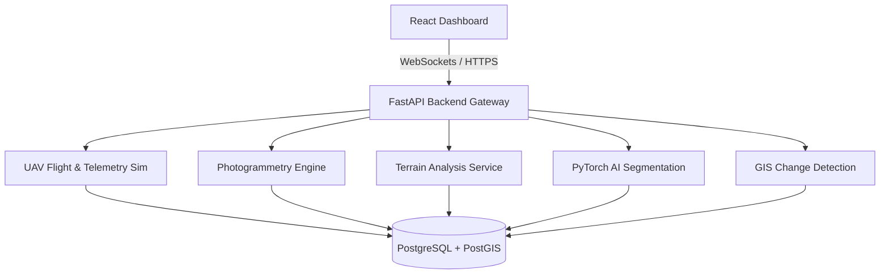

# Real-Time Mapping of Drone-Based Geomorphic Changes: Autonomous Earth Observation System (EOS)

This repository hosts the complete, enterprise-grade, production-ready microservice platform designed for autonomous drone operations, real-time geomorphic change analysis, and GIS processing. Built to fulfill PhD thesis requirements, it integrates state-of-the-art Python GIS libraries, PyTorch deep learning pipelines, real-time WebSocket telemetry, and Leaflet interactive dashboards.

## System Architecture

The platform follows a **Clean Architecture** with strict modular boundaries. 



---

## The 18 System Modules

1. **Mission Planning**: Boustrophedon grid generator with terrain-aware altitude adjustments matching DEM contours.
2. **Autonomous UAV Navigation**: 3D Artificial Potential Field model calculating real-time collision avoidance.
3. **Sensor Integration**: Driver mocks for RGB, LiDAR (XYZ point clouds), Multispectral (multiband TIF), and Thermal payloads.
4. **Real-Time Communication**: WebSocket broadcast manager handling low-latency telemetry updates and sensor triggers.
5. **Image Processing**: OpenCV lens radial distortion correction, bilateral filter edge preservation, and CLAHE enhancements.
6. **Photogrammetry**: SfM reconstruction interface producing georeferenced DEM, DSM, and Orthomosaic GeoTIFF products using Rasterio.
7. **Terrain Analysis**: Elevation matrices analysis calculating Slope, Aspect, Hillshade, contours, and hydrological D8 flow directions.
8. **AI Engine**: PyTorch land cover classification models (U-Net) with GPU optimization and checkpoint saving.
9. **Geomorphological Feature Detection**: Contour-based vector polygon extraction to identify landslides and riverbank erosion.
10. **Multi-Temporal Change Detection**: DEM Differencing (DoD) calculating erosion/sedimentation volumes and NDVI vegetation index shifts.
11. **GIS Analytics**: Spatial overlay intersection, vector buffers, and spatial Inverse Distance Weighting (IDW) interpolation.
12. **Validation**: Quantitative accuracy calculations comparing AI output against Ground Truth shapes (IoU, Cohen's Kappa, Precision, Recall).
13. **Dashboard**: Material UI cockpit showing live telemetry dials, interactive Leaflet coordinates map, and safety notifications.
14. **Decision Support**: Operational rules calculating risk indexes and issuing warning recommendations.
15. **Database**: Relational PostgreSQL database utilizing PostGIS spatial coordinates indexing (LineString, Point, Polygon).
16. **User Management**: Role-Based Access Control (RBAC) middleware verifying JWT tokens (Admin, Analyst, Field Engineer).
17. **Reporting**: Automated PDF report compiler with institutional sign-off lines and Excel spreadsheets exporter.
18. **Performance Monitoring**: Real-time hardware performance log tracker (CPU, GPU, inference latency, stream FPS).

---

## Getting Started

### Prerequisites
- Docker & Docker Compose
- Node.js v18 (for manual local development)
- Python 3.11 (for local virtual environments)

### Production Deployment (Docker Compose)
To launch the entire stack:
```bash
docker-compose up --build
```
This boots:
1. **Postgres & PostGIS Database** on port `5432` (automatically seeds initial credentials).
2. **Redis Message Queue** on port `6379`.
3. **FastAPI Web Service** on port `8000`.
4. **React Client Dashboard** on port `3000`.

### Database Access
- **Host**: `localhost`
- **User**: `eos_user`
- **Password**: `eos_password_secure`
- **DB Name**: `eos_db`

### Authentication Credentials
- **Username**: `admin@eos.org`
- **Password**: `admin123`
